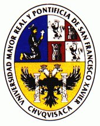

\
[1.3cm] **Vicerrectorado**\
[1.3cm] Centro de Estudios de Posgrado e Investigación\
[1.3cm] \
[1.3cm]\
Trabajo en opción al grao de Doctor en Ciencias de la
Educación\
Autor: José Boris Bellido Santa María\
Sucre, Septiembre de 2015

Cesión de Derechos {#cesión-de-derechos .unnumbered}
==================

Al presentar este trabajo como requisito previo para la obtención del
Título de Magister en Educación Superior de la Universidad Mayor, Real y
Pontificia de San Francisco Xavier de Chuquisaca, autorizo al Centro de
Estudios de Posgrado e Investigación o a la Biblioteca de la
Universidad, para que se haga de este trabajo un documento disponible
para su lectura, según normas de la Universidad.

También cedo a la Universidad Mayor, Real y Pontificia de San Francisco
Xavier de Chuquisaca, los derechos de publicación de este trabajo o
parte de él, manteniendo mis derechos de autor hasta un periodo de 30
meses posterior a su aprobación.\

José Boris Bellido Santa María

Dedicatoria {#dedicatoria .unnumbered}
===========

Para mis padres,\
José y Yolanda.

Agradecimientos {#agradecimientos .unnumbered}
===============

Resumen {#resumen .unnumbered}
=======

Introducción {#introducción .unnumbered}
============

Antecedentes {#antecedentes .unnumbered}
------------

Situación problémica {#situación-problémica .unnumbered}
--------------------

Formulación del problema de investigación {#formulación-del-problema-de-investigación .unnumbered}
-----------------------------------------

(Como afirmación o alternativamente como pregunta)

Hipótesis {#hipótesis .unnumbered}
---------

### Conceptualización de las variables {#conceptualización-de-las-variables .unnumbered}

### Operacionalización las de variables {#operacionalización-las-de-variables .unnumbered}

( Cuadro que determina por variable, sus dimensiones, categorías e
indicadores)

Objetivos de la investigación {#objetivos-de-la-investigación .unnumbered}
-----------------------------

### Objetivo general {#objetivo-general .unnumbered}

### Objetivos específicos {#objetivos-específicos .unnumbered}

Justificación {#justificación .unnumbered}
-------------

(Relevancia y pertinencia social, actualidad y novedad del tema)

Diseño metodológico {#diseño-metodológico .unnumbered}
-------------------

.(Acorde al enfoque cuantitativo en las ciencias sociales)2

Fundamentos teóricos y de contexto
==================================

Análisis e interpretación de las indagaciones de campo
======================================================

Propuesta y validación
======================

Conclusiones y recomendaciones {#conclusiones-y-recomendaciones .unnumbered}
==============================
